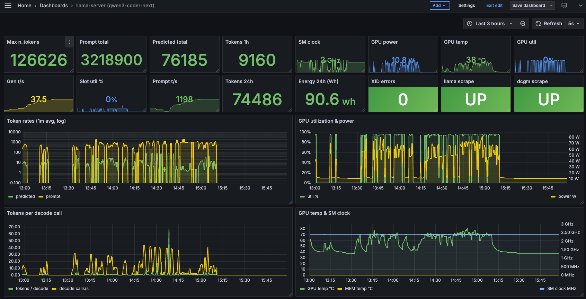

# 9. Monitoring (Prometheus + Grafana + DCGM)

[← Performance tuning](08-performance-tuning.md) · [Index](README.md) · [Next: Operations →](10-operations.md)

This page stands up a small monitoring stack on the same box, scraping:

- **`llama-server` /metrics** — request rate, queue depth, throughput, decode calls
- **NVIDIA DCGM Exporter** — GPU utilization, power, temperature, SM clock, XID errors, total energy
- **Prometheus itself**

Everything is **localhost-only**. You reach Grafana via an SSH tunnel.



## 9.1 Prerequisites

- The preset (page 6/8) sets `metrics = true`, so each model instance exposes `/metrics`. **In router mode `/metrics` is per-model:** you must pass `?model=<id>`, and the endpoint still requires the API key. Pass `&autoload=false` so a metrics scrape never *loads* a model by itself. Confirm against the model that's currently loaded:
  ```bash
  curl -H "Authorization: Bearer sk-alice-REPLACE_ME" \
       'http://127.0.0.1:8080/metrics?model=qwen3-coder-next&autoload=false' | head -20
  ```
  (Without `?model=` the router returns `400 model name is missing from the request`. For a model that's swapped out, with `autoload=false` you get `400 model is not loaded` — that's expected, see 9.4.)
- Docker + Docker Compose installed on the box. (The vendor image typically includes them. `docker --version && docker compose version` to verify.)
- Docker can pass the GPU through to containers. Test:
  ```bash
  sudo docker run --rm --gpus all ubuntu:24.04 ls /dev/nvidia0
  ```
  You should see `/dev/nvidia0`. If not, install the NVIDIA Container Toolkit.

## 9.2 Layout

```
/home/ADMIN_USER/llama-mon/
├── docker-compose.yml
├── prometheus/
│   └── prometheus.yml
└── grafana/
    ├── dashboards/
    │   └── llama-server.json     ← the dashboard JSON, attached below
    └── provisioning/
        ├── dashboards/default.yml
        └── datasources/prometheus.yml
```

Create the tree:

```bash
mkdir -p ~/llama-mon/{prometheus,grafana/provisioning/datasources,grafana/provisioning/dashboards,grafana/dashboards}
cd ~/llama-mon
```

## 9.3 `docker-compose.yml`

```yaml
services:
  prometheus:
    image: prom/prometheus:v3.0.1
    container_name: llama-prom
    restart: unless-stopped
    network_mode: host
    volumes:
      - ./prometheus/prometheus.yml:/etc/prometheus/prometheus.yml:ro
      - prom-data:/prometheus
    command:
      - --config.file=/etc/prometheus/prometheus.yml
      - --storage.tsdb.path=/prometheus
      - --storage.tsdb.retention.time=30d
      - --web.listen-address=127.0.0.1:9090

  grafana:
    image: grafana/grafana:11.3.1
    container_name: llama-grafana
    restart: unless-stopped
    network_mode: host
    depends_on:
      - prometheus
    volumes:
      - ./grafana/provisioning:/etc/grafana/provisioning:ro
      - ./grafana/dashboards:/var/lib/grafana/dashboards:ro
      - grafana-data:/var/lib/grafana
    environment:
      - GF_SERVER_HTTP_ADDR=127.0.0.1
      - GF_SERVER_HTTP_PORT=3000
      - GF_SECURITY_ADMIN_USER=admin
      - GF_SECURITY_ADMIN_PASSWORD=STRONG_PASSWORD
      - GF_USERS_ALLOW_SIGN_UP=false
      - GF_AUTH_ANONYMOUS_ENABLED=false

  dcgm-exporter:
    image: nvcr.io/nvidia/k8s/dcgm-exporter:4.2.3-4.1.3-ubuntu22.04
    container_name: llama-dcgm
    restart: unless-stopped
    network_mode: host
    cap_add:
      - SYS_ADMIN
    environment:
      - DCGM_EXPORTER_LISTEN=:9400
      - DCGM_EXPORTER_KUBERNETES=false
      - NVIDIA_VISIBLE_DEVICES=all
      - NVIDIA_DRIVER_CAPABILITIES=all
    deploy:
      resources:
        reservations:
          devices:
            - driver: nvidia
              count: all
              capabilities: [gpu]

volumes:
  prom-data:
  grafana-data:
```

Choose your own `STRONG_PASSWORD` (don't reuse anything from this guide).

`network_mode: host` is used so Prometheus can scrape the loopback-only `llama-server` and DCGM can reach NVML. The trade-off: Grafana binds to `127.0.0.1` only — that's deliberate. Use SSH local-port-forwarding to access it (see 9.7).

## 9.4 `prometheus/prometheus.yml`

```yaml
global:
  scrape_interval: 5s
  evaluation_interval: 15s

scrape_configs:
  # One job, one target per model. Router mode requires the ?model= param,
  # so we carry it as a per-target label and copy it into __param_model.
  # autoload=false prevents a scrape from loading a swapped-out model.
  - job_name: llama-server
    metrics_path: /metrics
    params:
      autoload: ['false']
    authorization:
      type: Bearer
      credentials: sk-prometheus-REPLACE_ME
    static_configs:
      - targets: ['127.0.0.1:8080']
        labels: { model: qwen3-coder-next, service: qwen3-coder-next }
      - targets: ['127.0.0.1:8080']
        labels: { model: qwen36-35b-a3b,  service: qwen36-35b-a3b }
    relabel_configs:
      # turn the per-target `model` label into the ?model= query param
      - source_labels: [model]
        target_label: __param_model
      # both targets share 127.0.0.1:8080; give them distinct instance labels
      - source_labels: [model]
        target_label: instance

  - job_name: dcgm
    static_configs:
      - targets: ['127.0.0.1:9400']
        labels:
          gpu: gb10

  - job_name: prometheus
    static_configs:
      - targets: ['127.0.0.1:9090']
```

The `credentials:` line is the bearer key Prometheus uses to scrape `llama-server`. Create a **dedicated** key for it (don't share with users):

```bash
key="sk-prometheus-$(openssl rand -hex 24)"
echo "$key" | sudo tee -a /etc/llama-server/api_keys.txt >/dev/null
echo "Use this in prometheus.yml: $key"
sudo systemctl restart llama-router
```

> **Swap mode and `up`.** With `--models-max 1` only one model is loaded at a time, so the scrape for the **swapped-out** model returns `400` and Prometheus shows `up{job="llama-server", instance="<that-model>"} == 0`. That is **expected**, not an outage — it just means the model isn't resident. The `job="llama-server"` label is preserved, so dashboard panels that filter on it keep working; per-model series are distinguished by the `instance` / `service` labels. See 9.11 for an alert rule that accounts for this.

## 9.5 Grafana provisioning

`grafana/provisioning/datasources/prometheus.yml`:

```yaml
apiVersion: 1

datasources:
  - name: Prometheus
    uid: prometheus
    type: prometheus
    access: proxy
    url: http://127.0.0.1:9090
    isDefault: true
    editable: false
```

> `uid: prometheus` is **load-bearing** — every panel in the dashboard JSON references the datasource by that UID. Don't change it.

`grafana/provisioning/dashboards/default.yml`:

```yaml
apiVersion: 1

providers:
  - name: llama
    orgId: 1
    folder: ''
    type: file
    disableDeletion: false
    updateIntervalSeconds: 10
    allowUiUpdates: true
    options:
      path: /var/lib/grafana/dashboards
```

`grafana/dashboards/llama-server.json` — see the [dashboard JSON appendix](#94-dashboard-json) at the end of this page.

## 9.6 Start the stack

```bash
cd ~/llama-mon
sudo docker compose up -d
sudo docker compose ps
```

All three containers should be `Up`. Verify Prometheus is scraping all three targets:

```bash
curl -sS 'http://127.0.0.1:9090/api/v1/targets?state=active' \
  | jq -r '.data.activeTargets[] | "\(.labels.job)\t\(.labels.instance)\t\(.health)"'
```

Expected output (the swapped-out model reads `down` — that's normal, see 9.4):

```
llama-server    qwen3-coder-next    up
llama-server    qwen36-35b-a3b      down
dcgm            gb10                up
prometheus      127.0.0.1:9090      up
```

## 9.7 Access Grafana

From your workstation:

```bash
ssh -L 3000:127.0.0.1:3000 -L 9090:127.0.0.1:9090 SERVER_HOST
```

Then open <http://127.0.0.1:3000> and log in with `admin` / `STRONG_PASSWORD` (from §9.3).

Direct dashboard URL inside the tunnel:
<http://127.0.0.1:3000/d/llama-server-main>

> Grafana's Home page only shows starred/recent dashboards. A freshly provisioned dashboard won't appear there until you open it once.

## 9.8 What's in the dashboard (22 panels)

```
Row 1 (stats × 8):
  Gen t/s | Prompt t/s | Predicted total | Prompt total |
  GPU util | GPU power | GPU temp | XID errors

Row 2 (stats × 8):
  Max n_tokens | llama scrape | dcgm scrape | SM clock |
  Energy 24h (Wh) | Tokens 1h | Tokens 24h | Slot util %

Row 3 (timeseries × 2):
  Throughput (tokens/sec, log) | Slots & queue

Row 4 (timeseries × 2):
  GPU utilization & power | GPU temp & SM clock

Row 5 (timeseries × 2):
  Token rates (1m avg, log) | Tokens per decode call
```

### Throughput vs Token rates — when to look at each

Both measure tokens/sec but answer different questions:

- **Throughput (log)** uses llama-server's own gauges. Reports the rate **while a request is running**; sits at the last value between requests. Good for *performance-regression checks* ("is GPU still hitting 50 t/s when it runs?").
- **Token rates (1m avg, log)** uses Prometheus `rate()` over counters with a 60 s window. Includes idle time and decays toward 0 between requests. Good for *utilization / capacity* ("how busy is the box overall?").

Both panels are log-scale because generation (~50 t/s) and prefill (~1000 t/s) differ by an order of magnitude.

## 9.9 GB10 quirks you'll notice

These DCGM metrics are **not available** on GB10 even though they're standard on discrete NVIDIA GPUs:

- `DCGM_FI_DEV_FB_USED` / `FB_FREE` — no separate framebuffer; GPU memory is the system memory. Use `/proc/meminfo` (e.g. via `node_exporter`) for memory accounting.
- `DCGM_FI_PROF_*` (tensor pipe active, memory bandwidth utilization, NVLink/PCIe bytes) — the DCP profiling module isn't loaded; DCGM container logs say `Not collecting DCP metrics: This request is serviced by a module of DCGM that is not currently loaded`.
- `DCGM_FI_DEV_MEM_COPY_UTIL` reads 0 (no copy engine in use on an iGPU).

These llama-server signals are **also not exposed** as metrics, even though they exist:

- KV-cache utilization in MiB
- Cache-reuse hit rate as %
- Per-slot state
- Per-API-key dimensions (llama-server has no concept of per-key labels)

For per-API-key analytics you need a proxy in front of `llama-server` (LiteLLM, Helicone, etc.). That's out of scope for this guide.

## 9.10 Operations

| Action | Command |
|---|---|
| Status | `sudo docker compose ps` |
| Logs | `sudo docker logs -f llama-prom \| llama-grafana \| llama-dcgm` |
| Apply config change | `sudo docker compose up -d` (re-reads YAMLs) |
| Reload Prometheus config | `sudo docker restart llama-prom` |
| Dashboard auto-reload | edit `grafana/dashboards/llama-server.json` — provisioner re-reads every 10 s, no restart needed |
| Change Grafana password | edit `GF_SECURITY_ADMIN_PASSWORD` in `docker-compose.yml`, then `sudo docker compose up -d` |

## 9.11 Suggested starter alerts

Configure these in Grafana (Alerting → Alert rules):

| Rule | Trigger |
|---|---|
| Router down / no model loaded | `count(up{job="llama-server"} == 1) == 0` for 2 min — fires when the router is down or **no** model is resident (don't alert on a single `up == 0`: that's just a swapped-out model) |
| Sustained queueing | `llamacpp:requests_deferred > 0` for 1 min |
| GPU temp high | `DCGM_FI_DEV_GPU_TEMP > 80` for 1 min |
| GPU fault | `DCGM_FI_DEV_XID_ERRORS > 0` |
| Throughput regression | `llamacpp:predicted_tokens_seconds < 20` for 2 min while `requests_processing > 0` |

---

## 9.12 Dashboard JSON

The full `grafana/dashboards/llama-server.json` is in [appendix/llama-server-dashboard.json](appendix/llama-server-dashboard.json) (provided alongside this guide). Drop it into `grafana/dashboards/` and the provisioner picks it up within 10 s.

---

[← Performance tuning](08-performance-tuning.md) · [Index](README.md) · [Next: Operations →](10-operations.md)
